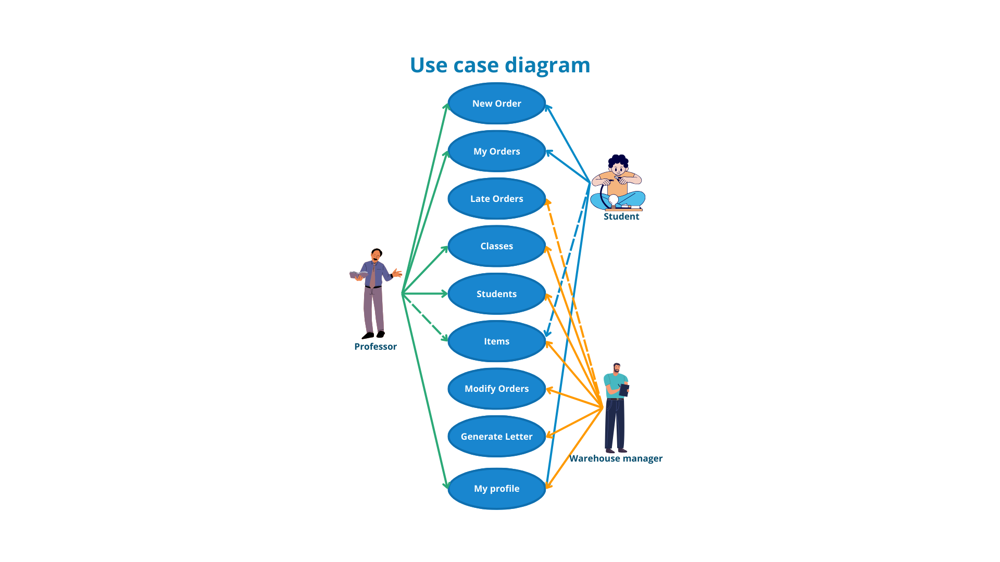
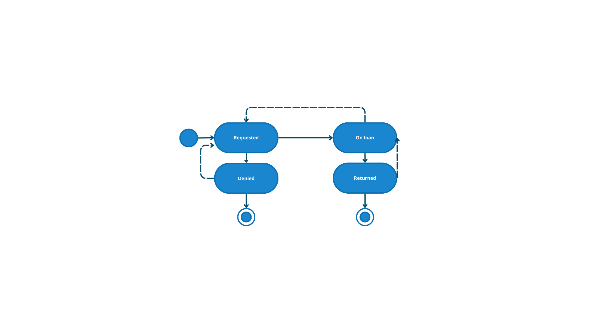
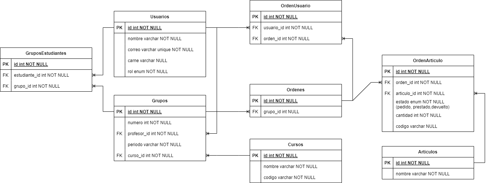

# Web Page for Managing Loaned Items from the EIE Warehouse

This project is a web page to manage the loans of items from the warehouse of the School of Electrical Engineering (EIE) at the University of Costa Rica. The goal is to digitize and optimize the loan process that is currently done through physical documents.

## Table of Contents
2. [Proposed Solution](#proposed-solution-for-the-project)
3. [Installation](#installation-for-local-use)
4. [Usage](#usage)
5. [Diagrams](#diagrams)
6. [Contact Information](#contact-information)
7. [Notes](#notes)
## Proposed Solution for the Project

The proposal is to create a web page that allows controlling the loans from the warehouse. This page will allow users to:

- Create loan orders equivalent to physical orders.
- View and modify their order history.
- See a list of available items in the warehouse.
- Professors can create and manage groups of students.
- Students can see which courses they are registered in and create shared orders with their work group.
- Warehouse staff can add and remove available items, modify other users' orders, and verify pending orders from previous semesters.

### Use case diagram



### State diagram



### Database


## Installation for Local Use

1. Clone the repository:
    ```sh
    git clone https://github.com/christabel-alvarado/Proyecto_Inventario.git
    ```
2. Navigate to the project directory:
    ```sh
    cd Proyecto_Inventario
    ```
3. Install dependencies:
    ```sh
    pip install -r requirements.txt
    ```
4. Perform database migrations:
    ```sh
    python manage.py migrate
    ```
5. Create superuser:
    ```sh
    python manage.py createsuperuser
    ```
6. Start the server:
    ```sh
    python manage.py runserver
    ```

## Usage

- Access `http://localhost:8000` in your browser.
- Log in (currently only developers have login information).
- Navigate through the available functionalities.
- To create users, use the Django admin view.


## Technologies Used
- Python 3.x
- Django 3.x
- SQLite (for development database)
- HTML/CSS/Tailwind/JavaScript (frontend)

## Prerequisites
- Python 3.10.12
- Django 5.0.4
- pip

## Contact information

### Technical supervisor
- Ing. Marco Villalta Fallas, MSc.
- Email: [soporte.eie@ucr.ac.cr](mailto:soporte.eie@ucr.ac.cr)

### Project supervisor
- Ing. Fausto Calderón Obaldía, PhD.
- Email: [fausto.calderonobaldia@ucr.ac.cr](mailto:fausto.calderonobaldia@ucr.ac.cr)

### Principal contributor
- Christabel Alvarado Anchía
- Email: [christabel.alvarado@ucr.ac.cr](mailto:christabel.alvarado@ucr.ac.cr)

## Notes

For future progress, the repository will be moved to the University of Costa Rica's Git site.
